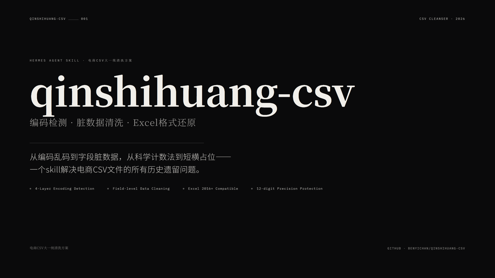

<p align="center">
  
</p>

<h1 align="center">qinshihuang-csv</h1>

<p align="center">
  <strong>电商CSV大一统清洗方案</strong><br>
  <em>E-commerce CSV Encoding Detection & Data Cleansing Toolkit</em>
</p>

<p align="center">
  <a href="#-背景">中文</a> · <a href="#-background">English</a>
</p>

<p align="center">
  <a href="https://github.com/benyichan/qinshihuang-csv/blob/main/LICENSE">
    
  </a>
</p>

---

# 🇨🇳 背景

事情是这样的。

做电商数据分析的人，大概率都跟我一样，跟CSV文件打过无数次架。

不同平台导出来的CSV，编码格式五花八门。这个用UTF-8，那个用GB18030，还有一个连自己什么编码都不知道。你拿Excel一打开，满屏乱码。你以为换个编码打开就完了？太天真了。同一个文件，用微软的Excel打开是乱码，用WPS打开又能正常显示——这根本就不是文件坏了，是解析规则不匹配。

但这还不是最要命的。

更要命的是那些**藏在字段里的脏数据**。你盯着屏幕看，肉眼完全发现不了：订单号前面悄咪咪跟了个空格，金额列里夹着各种币种符号，退款金额列里一个孤零零的减号" - "表示"此单无退款"——你以为是缺失值，实际上就是0。还有那些超过15位的纯数字，Excel好心帮你转成科学计数法，好么，后几位全变成0了，数据不可逆地丢了。

所以我就想，能不能像秦始皇统一度量衡一样，把这些乱七八糟的编码格式和脏数据统一清洗干净，搞一个大一统的方案出来。

## 踩过的坑

这个skill前后迭代了几十轮，踩的坑一个一个记录下来了。

### 坑1：编码检测不是你想的那么简单

你以为装个chardet就够了？天真。

第一版：chardet一把梭。结果碰到一个文件，chardet返回"置信度20.7%的某个中文编码"——低于我设的50%阈值，直接跳过了。然后回退列表一层层往下试，所有中文编码全挂了——因为文件里有一个损坏的字节。最后落到一个什么字节都能解码的西欧编码上，完美解码，出来一堆乱码。

> 起因：CSV文件在传输过程中有一个字节被写坏了。

**解决方法**：搞了一个四层检测管线。
1. BOM头检测（最快，0开销）
2. charset-normalizer（比chardet准）
3. chardet降门槛（检测到语言是中文时阈值从0.5降到0.2）
4. 广度回退列表（40+编码，对中文编码用容错模式 + 验证汉字数）

```python
# 核心逻辑：对中文编码尝试容错解码
if enc in cjk_encodings:
    decoded = raw_header.decode(enc, errors="replace")
    cjk_count = sum(1 for c in decoded if '\u4e00' <= c <= '\u9fff')
    if cjk_count >= 5:
        return enc  # 至少5个汉字才接受
```

### 坑2：XLSX设了格式不等于转了类型

这个坑是最隐蔽的。

我想着，把日期列设成 `YYYY-MM-DD HH:MM:SS` 格式、金额列设成 `#,##0.00` 格式，Excel不就能正确识别了吗？

结果一试：**日期筛选没有树状结构，金额左对齐**。

我查了半天，发现一个残酷的事实：**openpyxl的number_format只改变显示方式，不转换底层数据类型**。你往单元格里写一个字符串"2025-10-19 14:25:59"然后设日期格式，在Excel眼里它仍然是文本——左对齐，不可排序，筛选无树状结构。

**解决方法**：在写入XLSX之前，先把字符串转成真正的Python对象。

```python
# 日期列：先解析为datetime对象
dt = datetime.strptime("2025-10-19 14:25:59", "%Y-%m-%d %H:%M:%S")
ws.cell(row=r, column=c).value = dt
ws.cell(row=r, column=c).number_format = 'YYYY-MM-DD HH:MM:SS'

# 金额列：先转为float
ws.cell(row=r, column=c).value = float("799.00")
ws.cell(row=r, column=c).number_format = '#,##0.00'
```

这个顺序**必须**是先转换值，再设格式——反过来设了也没用。

### 坑3：CSV长数字被科学计数法吃掉

有时候订单号有19位，在CSV文件里好好的，Excel一打开变成 `1.23E+18`，后几位变成0——**数据不可逆地丢失了**。

第一版解决方案：用Excel公式写法 `="1901234567890123456789"`。

用户看了一眼，说："单元格显示的是=号公式，不是我要的纯数字。"

第二版：改用前导单引号 `'1901234567890123456789`。Excel打开时单引号自动隐藏，单元格显示纯数字，不转科学计数法。

另外，阈值从15位降到12位——因为12位的商品编码在Excel里也可能触发科学计数法。

### 坑4：CSV的UTF-8没有BOM

用户指定了utf-8编码，结果Excel打开全乱码。

原因是中文Windows版Excel打开无BOM的UTF-8 CSV时，会按本地编码解析。**解决方案：不管用户指定utf-8还是utf-8-sig，CSV输出统一用utf-8-sig**。

### 坑5：金额列里的减号不是减号

金额列里常常出现一个孤零零的 `-`——这不是数据缺失，这是"此单无此款项"，值就是0。

所以我加了一个逻辑：在数值格式列中检测纯减号/短横/破折号，替换为"0"。

```python
if col in dash_set and is_pure_dash(cleaned):
    df_clean.at[idx, col] = "0"
```

## 用到的

| 依赖 | 用途 |
|------|------|
| Python 3.13+ | 运行环境 |
| pandas | CSV读写、DataFrame处理 |
| charset-normalizer | 主编码检测 |
| chardet | 编码检测兜底 |
| openpyxl | XLSX写入（Excel 2016+兼容） |
| clevercsv（可选） | CSV方言检测（分隔符/引号） |

## 反馈 / 已知问题

- **大文件性能**：当前逐格循环清洗在10万行×80列以上会显著变慢，后续考虑优化
- **Chardet中文置信度**：中文编码的文件被chardet检测时置信度可能低至0.2，已在代码中特殊处理
- **安装网络问题**：部分依赖在Windows下可能因SSL证书安装失败，不影响核心功能

---

# 🇬🇧 Background

If you work with e-commerce data, you've probably fought the same war with CSV files that I have.

Different platforms export CSVs with different encodings. One uses UTF-8, another uses GB18030, a third doesn't even tell you what it's using. Open any of these in Excel and you get a screen full of garbled text. And here's the kicker — the same file opens fine in one spreadsheet application and turns to gibberish in another. The file isn't broken. The parsing rules just don't match.

But that's not even the worst part.

The real nightmare is the **hidden dirt** lurking inside the fields. An extra space before an order number. Currency symbols embedded in price columns. A lonely dash `-` in a refund column that actually means "zero" — not missing, just zero. And those long numbers — anything over 15 digits — Excel kindly converts to scientific notation, turning the last digits to zeros. Data loss, permanent.

So I thought: why not do what Qin Shi Huang did with weights and measures — unify the chaos, clean up the mess, make everything work together? That's how qinshihuang-csv was born.

## The Pitfalls

### 1. Encoding Detection Is Not That Simple

First version: throw chardet at it. Naive.

I hit a file where chardet returned "some Chinese encoding with 20.7% confidence" — below my 50% threshold. The fallback tried all Chinese encodings — all failed because of a single corrupted byte. Finally it landed on cp1252, which decodes everything without errors, and produced beautiful gibberish.

**Fix**: 4-layer pipeline — BOM detection → charset-normalizer → chardet (lowered threshold for Chinese) → 40+ encoding fallback with CJK validation.

### 2. XLSX Format ≠ Type Conversion

Setting `number_format` on a cell doesn't convert the underlying value. A string stays a string — left-aligned, unsortable, unfilterable.

**Fix**: Convert strings to proper Python objects (datetime, float) BEFORE writing to XLSX. Order matters — type first, format second.

### 3. Scientific Notation Eats Long Numbers

A 19-digit order ID looks fine in the CSV. Excel opens it as `1.23E+18`, last digits zeroed out. Data loss, irreversible.

**Fix**: Leading single quote `'1901234567890123456789`. Excel hides the quote, displays the pure number. Also lowered the protection threshold from 15 to 12 digits.

### 4. UTF-8 Without BOM

User specified UTF-8. Excel showed garbage. Reason: Windows Excel interprets BOM-less UTF-8 as local encoding.

**Fix**: Always use utf-8-sig for CSV output, regardless of what the user specified.

### 5. That Dash in the Amount Column

A single `-` in a numeric column isn't missing data — it means "zero for this line."

**Fix**: Detect pure dashes in numeric columns and replace with "0".

## Stack

| Dependency | Purpose |
|------------|---------|
| Python 3.13+ | Runtime |
| pandas | CSV I/O, DataFrame |
| charset-normalizer | Primary encoding detection |
| chardet | Fallback encoding detection |
| openpyxl | XLSX output (Excel 2016+) |
| clevercsv (optional) | CSV dialect detection |

## Known Issues

- **Large file performance**: Cell-by-cell iteration slows above 100K rows × 80 cols. Optimization planned.
- **Chardet CJK confidence**: Chinese-encoded files may score as low as 0.2 — handled specially.
- **Network install**: Some dependencies may fail under Windows due to SSL — core unaffected.

---

**⭐ If this project saved you from one more CSV-induced headache, give it a star.**

> 像秦始皇统一度量衡一样，把编码格式和脏数据统一清洗干净。
>
> Like how Qin Shi Huang unified weights and measures — bring order to the chaos of CSV encodings and dirty data.
>
> Built with ❤️ for every analyst who's ever opened a CSV and screamed.

## License

[MIT](LICENSE) © benyichan
